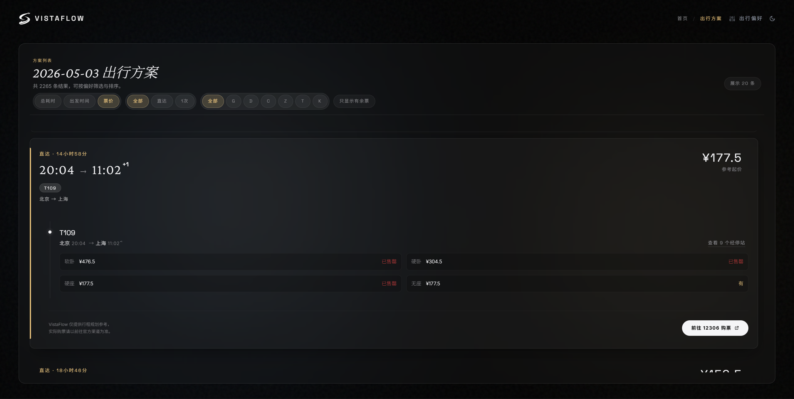
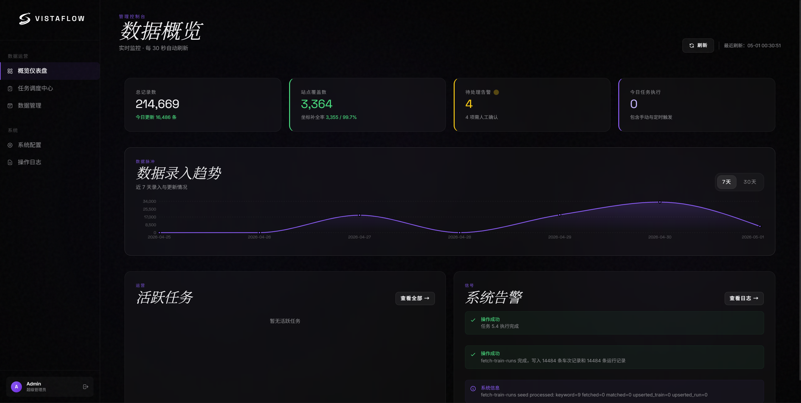

<p align="center">
  
</p>

<h1 align="center">VistaFlow</h1>

<p align="center">
  一个更自由、更完整的铁路乘车方案搜索引擎。
</p>

<p align="center">
  不只给你平台想展示的结果，而是尽量把可选方案找全，让你按自己的要求来选。
</p>

- 尽量找全乘车方案
- 不受商业推荐影响
- 支持按时间、换乘、车次、车型等条件筛选


## 它是做什么的

VistaFlow 是一个帮你查铁路出行方案的项目。

它不卖票，也不把重点放在推荐你下单。它更关心的是，当你要从 A 到 B 的时候，能不能更快看到更完整的方案，并且按更公平的方式去比较这些方案。

很多第三方平台也能查乘车方案，但常见的问题是：

- 结果不一定全
- 排在前面的不一定最适合你
- 结果可能会受到商业推荐和展示策略影响
- 你能自己控制的筛选条件不够多

VistaFlow 想做的事情很直接：

- 把方案尽量找全
- 把排序尽量做得公正
- 把决定权尽量交回给用户

它不替你做商业判断，只帮你做出行判断。

## 核心亮点

### 1. 方案更完整

很多平台展示给你的，是“平台优先想给你看的结果”。  
VistaFlow 更看重的是把可选路线尽量找全，减少你错过合适方案的概率。

### 2. 排序更公正

VistaFlow 不把结果和商业推荐绑定在一起。  
它更关心的是：

- 换乘是不是更少
- 总时间是不是更短
- 出发和到达时间是不是更合适

也就是说，它更关注“这条路线对你是不是更好”，而不是“这条路线对平台是不是更有利”。

### 3. 条件可以按你自己的要求来

你可以按自己的出行习惯去筛选，比如：

- 出发时间窗口
- 到达截止时间
- 最小 / 最大换乘时长
- 最大换乘次数
- 允许或排除的车次
- 允许或排除的车型
- 允许或排除的换乘站

### 4. 默认同站换乘

所有换乘方案默认保证在同一车站内完成，避免给出“理论能换、实际很难换”的路线。

### 5. 带完整后台

除了用户搜索端，项目还提供管理后台，用来维护基础数据、更新任务和查看系统状态。  
它不是一个一次性的页面，而是一套可以持续维护的完整系统。

## 界面预览






## 与常见平台的区别

| | 常见平台 | VistaFlow |
|---|---|---|
| 重点 | 卖票、成交、推荐 | 查方案、选方案 |
| 结果完整度 | 不一定全 | 尽量找全 |
| 排序 | 可能受商业因素影响 | 更公正、更稳定 |
| 条件控制 | 比较有限 | 用户可控更多 |
| 换乘体验 | 有方案，但不一定够细 | 默认同站换乘 |

## 技术栈

**后端** `apps/api`

- Python 3.12
- FastAPI
- asyncpg
- PostgreSQL
- Redis

**前端** `apps/web`

- React 19
- TypeScript
- Vite

**管理端** `apps/admin`

- React 19
- TypeScript
- Vite

## Repository Structure

```text
.
├── apps/
│   ├── api/             # FastAPI 后端服务
│   ├── web/             # 用户端 Web 应用
│   └── admin/           # 管理端 Web 应用
├── packages/            # 共享包
└── infra/               # SQL 与基础设施相关文件
```

## Requirements

- Node.js 20+
- pnpm 10+
- Python 3.12
- `uv`
- PostgreSQL 16
- Redis

## Quick Start

支持两种启动方式，推荐直接使用 Docker。

### 方式一：Docker 启动（推荐）

1. 在仓库根目录准备 `.env`

```bash
ADMIN_USERNAME=admin
ADMIN_PASSWORD=admin
ADMIN_TOKEN=replace-with-a-long-random-token
```

2. 启动服务

```bash
docker compose up -d
```

3. 首次启动时，PostgreSQL 会自动初始化，并读取以下基础数据文件：

- `infra/sql/seeds/stations.csv`
- `infra/sql/seeds/trains.csv`
- `infra/sql/seeds/train_stops.csv`

如需更完整的 Docker 说明，可查看：

- [DOCKER_DEPLOY.md](./DOCKER_DEPLOY.md)

### 方式二：本地开发启动

1. 安装依赖

```bash
pnpm install
```

2. 配置后端环境

```bash
cd apps/api
uv sync
cp .env.example .env.development
```

3. 启动 API

```bash
cd apps/api
uv run uvicorn app.main:app --reload --port 8000
```

- Swagger：`http://localhost:8000/docs`
- 健康检查：`http://localhost:8000/healthz`

4. 启动 Worker

```bash
cd apps/api
uv run python -m app.tasks.worker
```

5. 启动前端

```bash
pnpm dev:web
pnpm dev:admin
```

## Documentation

- [API README](./apps/api/README.md)
- [Web README](./apps/web/README.md)
- [Admin README](./apps/admin/README.md)
